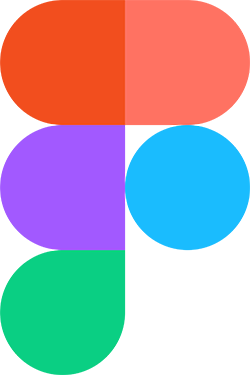
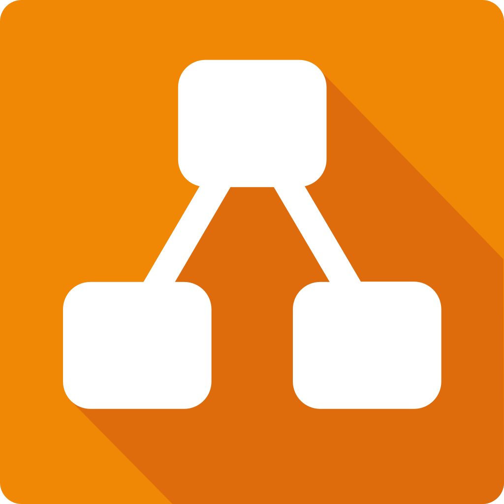

## Introdução. 

Ao longo do projeto foi utilizado uma gama de ferramentas com propósitos específicos no desenvolvimento. Essas ferramenyas contribuiram desde nossas tabelas e gráficos até ao upload de vídeos para registro. Aqui diferente da etapa de desenvolvimento, listataremos as ferramentas que foram efetivamente utilizadas. 

## Objetivo

O nosso objetivo aqui é mostrar a diferença entre as ferramentas planejadas a serem usadas e as que realmente foram, bem como apresentar ferramentas que estavam fora do escopo original mas forma utilizadas para incorporar o estudo da matéria. 

## Metodologia

Abaixo listaremos as ferramentas em uma tabela, então criaremos um tópico explicando onde cada ferramenta foi utilizada, o link para página e um print que comprova sua utilização.

## Tabela: 

<b>Tabela 1:</b> Ferramentas

    <table>
        <thead>
            <tr>
                <th>Ícone</th>
                <th>Ferramenta</th>
                <th>Finalidade</th>
            </tr>
        </thead>
        <tbody>
            <tr>
                <td> </td>
                <td>Figma</td>
                <td>Prototipação e design de interfaces para o projeto.</td>
            </tr>
            <tr>
                <td></td>
                <td>Google Docs</td>
                <td>Colaboração e criação de documentos durante o desenvolvimento.</td>
            </tr>
            <tr>
                <td></td>
                <td>GitHub</td>
                <td>Controle de versão e repositório de código para o projeto.</td>
            </tr>
            <tr>
                <td></td>
                <td>MkDocs</td>
                <td>Criação de documentação estruturada para o projeto.</td>
            </tr>
            <tr>
                <td></td>
                <td>VSCode</td>
                <td>Edição e desenvolvimento do código-fonte do projeto.</td>
            </tr>
            <tr>
                <td></td>
                <td>WhatsApp</td>
                <td>Comunicação rápida entre os membros da equipe durante o projeto.</td>
            </tr>
            <tr>
                <td></td>
                <td>ThisPersonDoesNotExist</td>
                <td>Criação de rosto para personas, que não sejam vinculadas a um indivíduo real ou que seja coberto por direitos autorais.</td>
            </tr>
            <tr>
                <td></td>
                <td>YouTube</td>
                <td>Referência de tutoriais e conteúdos técnicos relacionados ao projeto.</td>
            </tr>
            <tr>
                <td></td>
                <td>Draw.io</td>
                <td>Criação de modelos ou histórias de usuário.</td>
            </tr>
            <tr>
                <td></td>
                <td>Microsoft Teams</td>
                <td>Realização e gravação das Reuniões do grupo.</td>
            </tr>
        </tbody>
    </table>
    
<b>Autor:</b> Davi

## Figma

Figma é a plataforma na qual o grupo fez o desenvolvimento de suas [Prototipações de alta fidelidade](../Rastreabilidade/Elos.md)

    <figure>
        
        <figcaption>Imagem 1: Print do protótipo de alta fidelidade</figcaption>
    </figure>

## Google Docs.

Google docs é uma alternativa open source da google onde podemos usar algumas funções do word em conjunto, optamos pela praticidade não pelo leque de ferramentas da plataforma. A plataforma foi utilizada exclusivamente para desenvolvimento de atividades pessoais e envio dos links de entrega e vídeo para o professor.

## Github

Github é a ferramenta mais importante do projeto, é com ele que realizamos o versionamento e a aplicação de conteúdo simultânea ao projeto, bem como a hospedagem para qualquer um que precise ver o projeto em código. O Github também é parte essêncial de como a página do projeto é hospedada. Foi utilizado em todo o projeto. 

    <figure>
        
        <figcaption>Imagem 2: Print de repositório em evidência</figcaption>
    </figure>

## MKDOCS

Mkdocs é um gerador de sites estáticos via markdowns onde realizamos o desenvolvimento de nossa documentação. É um dos pilares do nosso projeto uma vez que toda documentação foi escrita e se tornou funcional por ele. Foi utilizado em todo o projeto, também era um dos requisitos de desenvolvimento do projeto na matéria.

## Vscode 

Foi utilizado em todo o projeto para edição e desenvolvimento do código fonte do projeto. utilizado por comodiade e familiaridade com este editor de código fonte em específico. 

## Whatsapp

Ferramenta principal de comunicação do grupo, uma vez que com uma agenda discrepante entre os horários da grande maioria, muitas informações só podiam ser passadas e organizadas através dele.  Utilizado em todo projeto.

## ThisPersonDoesNotExist

É uma ferramenta de IA genrativa que utiliza um banco de rostos para gerar rostos de pessoas que não existem na vida real, evitando qualquer processo legal com uso de imagem. Foi utilizado pelo grupo durante o desenvolvimento da documentação de [Personas](../PerfilUsuario/Personas.md).

    <figure>
        
        <figcaption>Imagem 3: Print do documento de personas.</figcaption>
    </figure>

## Youtube 

Youtube é uma plataforma de vídeos onde qualquer um pode subir seu vídeo mesmo que não tenha a intenção de compartilha-lo. O Youtube é um dos requisitos no plano de ensino, onde as nossas apresentações devem aparecer na categoria não listado. Utilizando o youtube para subir os vídeos nós realizamos seu uso em todas as categorias que necessitam de material de comprovação em vídeo, sendo: [Apresentações](../Home/apresentacao1.md), [Inspeções](../Revisao/Etapa1/planejamento1.md), e [técnicas de priorização](../PerfilUsuario/TecnicasPrior/100.md).

    <figure>
        
        <figcaption>Imagem 4: Print de um exemplo de vídeo do youtube no git pages.</figcaption>
    </figure>

## Draw.Io

Draw.io foi utilizado para criação dos documentos de [Caso de Uso](../Modelagem/Caso_de_uso.md) 

    <figure>
        
        <figcaption>Imagem 5: Print de um exemplo de caso de uso.</figcaption>
    </figure>

## Microsoft TEAMS

Microsoft teams é uma plataforma de reuniões online onde nos dedicamos a fazer algumas reuniões, bem como a gravação das [Apresentações](../Apresentacao/entrega1.md) e vídeos de [Inspeções](../Revisao/Etapa1/planejamento1.md)

## Bibliografia
> 1. Figma disponível em: https://www.figma.com/  Acessado dia 08/02/2025 ás 14:25  
> 2. Google Docs Disponível em:https://docs.google.com/document/u/0/?hl=pt-BR Acessado dia 108/02/2025 ás 14:26  
> 3. Github Disponível em:  https://github.com/ Acessado dia 08/02/2025 ás 14:25   
> 4. Mkdocs Disponível em: https://www.mkdocs.org Acessado dia 08/02/2025 ás 14:25   
> 5. Vscode Disponível em: https://code.visualstudio.com/ Acessado dia 08/02/2025 ás 14:25    
> 6. whatsapp Disponível em: https://web.whatsapp.com Acessado dia 08/02/2025 ás 14:25    
> 7. This Person does not exist Disponível em: https://thispersonnotexist.org/ Acessado dia 08/02/2025 ás 14:25  
> 8. Youtube Disponível em: https://www.youtube.com/ Acessado dia 08/02/2025 ás 14:25  
> 9. Draw.io Disponível em: https://app.diagrams.net/ Acessado dia 08/02/2025 ás 14:27 
> 10. Microsoft Teams disponível em: https://www.microsoft.com/pt-br/microsoft-teams/log-in Acessado dia 08/02/2025 ás 14:29  

## :round_pushpin: Histórico de Versão 

    <table style="margin: auto;">
        <tr>
            <th>Data</th>
            <th>Versão</th>
            <th>Descrição</th>
            <th>Autor</th>
            <th>Data de Revisão</th>
            <th>Revisor</th>
        </tr>
        <tr>
            <td>08/02/2025</td>
            <td>1.0</td>
            <td>Criação inicial do documento e adição de links e prints</td>
            <td><a href="https://github.com/Jagaima">Davi</a></td>
            <td>08/02/2025</td>
            <td><a href="https://github.com/Joa0V">João Ribeiro</a></td>
         </tr>    
        </table>
    

