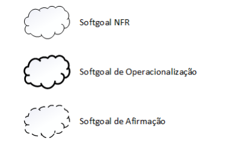
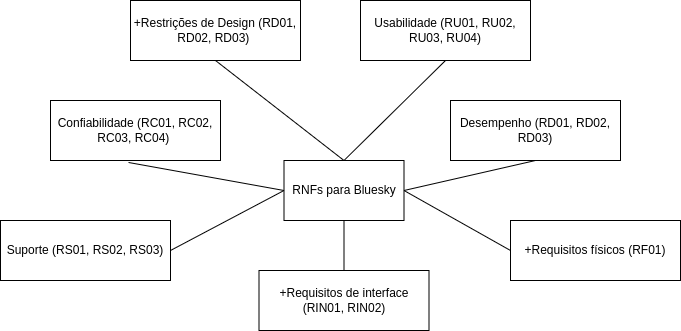
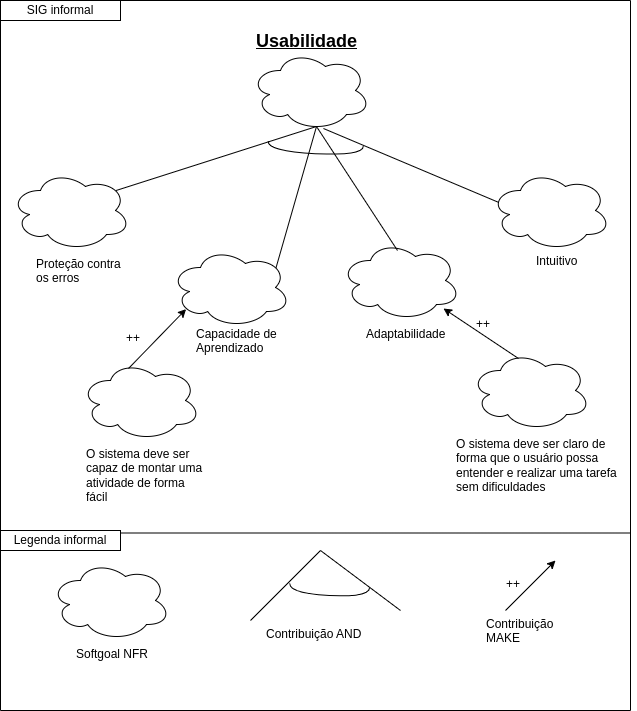
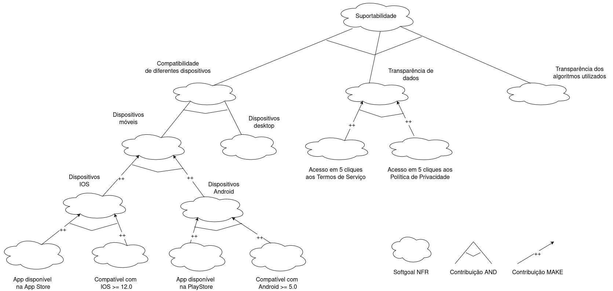

## Introdução
Os Requisitos Não-Funcionais são essenciais para garantir a qualidade e o sucesso de um sistema de software, influenciando diretamente a experiência do usuário, o desempenho e a conformidade com regulamentos. No entanto, esses requisitos muitas vezes não recebem a devida atenção durante o processo de desenvolvimento. Estudos apontam que os RNFs são frequentemente mal elicitados, especificados e gerenciados, resultando em impactos negativos na satisfação dos stakeholders e na qualidade final do produto ([(CHUNG et al., 2000)](#bibliografia); [LAUESEN, 2002](#lausen)). Além disso, a subjetividade, relatividade e interatividade inerentes aos RNFs tornam sua documentação e análise um desafio adicional [(CHUNG et al., 2000)](#bibliografia).

Para abordar essas dificuldades, o NFR Framework foi proposto como uma abordagem estruturada para modelar e analisar RNFs. Criado por Chung et al. (2000), o framework adota o conceito de softgoal — objetivos que não possuem critérios de satisfação claramente definidos. Cada softgoal representa um requisito não-funcional, como usabilidade, segurança ou desempenho, e é modelado em um grafo de interdependência de softgoals (SIG). Esses grafos permitem visualizar as relações entre os RNFs, destacando como eles podem se apoiar ou entrar em conflito entre si.

O Softgoal Interdependency Graph (SIG) pode ser de três formas no NFR Framework, como mostra a figura 1, além de possuir um tipo (determinado NFR) e um ou mais tópicos (assunto relacionado ao NFR). 

- **Softgoals NFR**: representam os Requisitos Não-Funcionais do sistema. Eles podem estar interconectados, organizados em catálogos, e dispostos de maneira hierárquica durante o desenvolvimento do projeto, ajudando a estruturar os objetivos de qualidade do sistema [(CHUNG et al., 2000)](#bibliografia).

- **Softgoals de Operacionalização**: são as soluções práticas para atender aos softgoals NFR ou a outros softgoals de operacionalização. Essas soluções incluem definições de operações, processos, estruturas de dados e restrições do sistema, permitindo que os objetivos de qualidade sejam implementados de forma eficaz no sistema em desenvolvimento [(CHUNG et al., 2000)](#bibliografia).
 
- **Softgoals de Afirmação**: refletem as características específicas do domínio, como prioridades ou carga de trabalho, e ajudam no processo de decisão. Esses softgoals justificam as escolhas feitas durante o refinamento, priorização e seleção de componentes do sistema. Eles fornecem suporte para revisão, ajustes e rastreabilidade das decisões de desenvolvimento [(CHUNG et al., 2000)](#bibliografia).

<b>Figura 1:</b> Tipos de Softgoals

  

<figure markdown="span">
  { width="500" align="center" }
</figure>

<b>Fonte:</b> <a href="#bibliografia">(CHUNG et al., 2000)</a>
  

## Objetivo  
O objetivo deste trabalho é construir um artefato baseado no NFR Framework que permita a identificação, representação e avaliação dos requisitos não-funcionais para o aplicativo Bluesky. Especificamente, buscamos:

1.	Mapear os requisitos não-funcionais relevantes para o Bluesky.

2.	Estruturar esses requisitos em um grafo de interdependência de softgoals (SIG).

3.	Fornecer diretrizes para análise e tomada de decisão durante o desenvolvimento do aplicativo.

4.	Validar o artefato proposto por meio de revisão e aprovação dos stakeholders envolvidos.

## Metodologia  
Para uma abordagem completa, dividimos a metodologia em algimas fases, sendo elas:

- **Fase 1: Elicitação de Requisitos Não-Funcionais**:  

    A elicitação de requisitos é uma atividade essencial que visa compreender as expectativas dos stakeholders e os atributos de qualidade do sistema. Isso foi realizado no artefato [Requisitos Elicitados](../../PerfilUsuario/Tecnicas/Requisitosel.md/#requisitos-elicitados).

- **Fase 2: Construção da Taxonomia Inicial**:

    De acordo com a abordagem do NFR Framework (Chung et al., 2000), criar uma taxonomia é fundamental para organizar e categorizar os RNFs:

    - Agrupar os RNFs por categorias como confiabilidade, desempenho, segurança e usabilidade. Utilizaremos o modelo FURPS+ como descrito no artefato [Especificação Suplementar](../../Modelagem/Especificacao.md).

- **Fase 3: Criação de Grafos de Decomposição de Softgoals e Criação de Cartões de Especificação**:

    Nesta etapa, a taxonomia inicial é transformada em grafos SIG (Softgoal Interdependency Graphs). Vamos decompor cada softgoals em componentes menores.

    Inspirando-se em técnicas de especificação (como as descritas no livro Requirements Engineering Fundamentals) faremos o cartão de especificação para cada decomposição:

    -	Para cada softgoal, criar cartões que detalhem:

    -	Descrição do RNF.

    -	Alternativas de implementação.

    -	Dependências e restrições.

    -	Os cartões ajudam a capturar os trade-offs entre alternativas e priorizações.

- **Fase 4: SIG**:

    Após a criação dos grafos de decomposição, o SIG é consolidado:

    -	SIG: Integrar todos os softgoals, suas contribuições e refinamentos no grafo final, criando uma visão abrangente dos RNFs para o sistema Bluesky.

- **Fase 5: Avaliação e Validação**:

    Por fim, validar o artefato construído, considerando os seguintes passos:

    -	Seleção entre alternativas: Comparar diferentes abordagens utilizando critérios de qualidade, custos e impacto para selecionar a melhor solução.

    -	Revisão com stakeholders: Submeter o SIG final para análise dos stakeholders e ajustar conforme o feedback recebido.

## Fase 1: Elicitação de Requisitos Não-Funcionais 

Como já descrito anteriormente, os requisitos não-funcionais foram elicitados e organizados no artefato [Requisitos Elicitados](../../PerfilUsuario/Tecnicas/Requisitosel.md/#reqnaofun). Foram elicitados ao total 16 requisitos não-funcionais para o aplicativo Bluesky.

## Fase 2: Construção da Taxonomia Inicial

Em busca de entender e organizar os requisitos não-funcionais foi feito a taxonomia, como mostra a figura 1. A taxonimia "é um esquema de classificação, que permite descrição de termos e suas relações no contexto de uma área de conhecimento" (Silva Reinaldo, 2019, p. 44). Anteriormente, foi realizada a [Espeção Suplementar](../../Modelagem/Especificacao.md) com a metodologia FURPS+, a Taxonomia foi contruída com base neste artefato. 

<b>Figura 2:</b> Taxonomia

<figure markdown="span">
  { width="800" align="center" }
</figure>

<b>Autor:</b> <a href="https://github.com/Renatinha28">Renata Quadros</a>
 

## Fase 3: Criação de Grafos de Decomposição de Softgoals e Criação de Cartões de Especificação

Após a taxonomia realizada, são realizados X Softgoals decompostos individualmente e os cartões de especificação com o objetivo de ilustrar os requisitos não-funcionais no contexto real de um sistema. A tabela 1 mostra o modelo que deve ser seguido para a construção dos cartões e foi realizado pela integrante [Renata Quadros](https://github.com/Renatinha28).

<b>Tabela 1:</b> Cartão de especificação modelo

| Item | Descrição |
|:-----:|:---------:|
| **Nr Requisito** (Um número sequencial)| **Classificação**: Classificação do RNF conforme hierarquia do catálogo | 
| **Descrição** | Declaração única do significado do requisito |
| **Justificativa** | Justificativa sobre a criação do requisito |
| **Origem** | Origem do requisito (stakeholder, norma técnica, etc) |
| **Critério de Aceitação** | Métrica do requisito que possa ser testada e que deve ser satisfeita |
| **Dependências** | Requisitos relacionados a este |
| **Prioridade** | Um número usado para decidiar a importância relativa deste requisito entre os outros RNFs (varia de 1 a 10). A prioridade mínima é 1 e a máxima é 10 |
| **Conflitos** | Requisitos conflitantes com este |
| **História** | Data de criação e de modificações |

<b>Fonte:</b> <a href="#cartao">Adaptado de (ROBERTSON; ROBERTSON, 2012)</a>
 

### Usabilidade

A figura 2 mostra a decomposição do softgoal Usabilidade feito pela integrante [Renata Quadros](https://github.com/Renatinha28)

<b>Figura 3: </b>Decomposição do softgoal Usabilidade

<figure markdown="span">
  { width="700" align="center" }
</figure>

<b>Autor:</b> <a href="https://github.com/Renatinha28">Renata Quadros</a>
 

As tabelas 2, 3, 4 e 5 mostram o cartão suplementar de cada softgoal dentro de usabilidade e foi feito pela integrante  [Renata Quadros](https://github.com/Renatinha28).

<b>Tabela 2</b> Cartão de especificação: Proteção contra erros 

| Item | Descrição |
|:-----:|:---------:|
| **Nr Requisito**: NFR01| **Classificação**: Usabilidade |
| **Descrição** | O sistema deve prevenir erros comuns dos usuários, oferecendo validação de entradas e mensagens de erro claras.|
| **Justificativa** | Garantir que os usuários não cometam erros inesperados ao usar a plataforma, melhorando a experiência geral. |
| **Origem** | Stakeholder(Usuários)  |
| **Critério de Aceitação** | A taxa de erros por usuário deve ser inferior a 1% em tarefas comuns e 90% das mensagens de erro devem ser claras.  |
| **Dependências**| Requisito de feedback imediato e interface amigável |
| **Prioridade**   | 8 |
| **Conflitos** | Pode conflitar com requisitos que priorizam a flexibilidade total em interfaces de uso complexo.    |
| **História**   | Criado em 16/12/2024. Última modificação em 16/12/2024. |

<b>Autor:</b> <a href="https://github.com/Renatinha28">Renata Quadros</a>
 

<b>Tabela 3</b> Cartão de especificação: Capacidade de Aprendizado 

| Item  |Descrição  |
|:-------------------------:|:------------------------------------------------------------------------------------------------------------------:|
| **Nr Requisito**: NFR02    | **Classificação**: Usabilidade  |
| **Descrição** | O sistema deve permitir que novos usuários aprendam a usá-lo de forma eficiente dentro de 30 minutos de uso.        |
| **Justificativa** | A facilidade de aprendizado reduz a frustração e acelera a adoção do sistema por novos usuários.  |
| **Origem**  | Stakeholder (Usuários e equipe de produto)    |
| **Critério de Aceitação**    | O tempo médio de aprendizado de um usuário deve ser inferior a 60 segundos   |
| **Dependências**  | Nenhum    |
| **Prioridade**            | 9 |
| **Conflitos**             | Nenhum |
| **História**  | Criado em 16/12/2024. Última modificação em 16/12/2024.   |

<b>Autor:</b> <a href="https://github.com/Renatinha28">Renata Quadros</a>
 

<b>Tabela 4</b> Cartão de especificação: Intuitivo 

| Item                 | Descrição      |
|:-------------------------:|:------------------------------------------------------------------------------------------------------------------:|
| **Nr Requisito**: NFR03    | **Classificação**: Usabilidade   |
| **Descrição**             | O sistema deve ser intuitivo, permitindo que usuários naveguem e encontrem funcionalidades sem necessidade de treinamento.|
| **Justificativa**         | Facilitar a navegação sem a necessidade de suportes externos melhora a experiência do usuário e reduz o tempo de adaptação.|
| **Origem**  | Stakeholder (Usuários)         |
| **Critério de Aceitação**    | 85% dos usuários devem ser capazes de concluir tarefas principais sem ajuda externa após 10 minutos de uso.         |
| **Dependências**  | Requisitos de design de interface e feedback visual claro.  |
| **Prioridade**   | 10 |
| **Conflitos**  | Pode entrar em conflito com requisitos de design altamente personalizado ou complexo.    |
| **História** | Criado em 16/12/2024. Última modificação em 16/12/2024.       |

<b>Autor:</b> <a href="https://github.com/Renatinha28">Renata Quadros</a>
 

<b>Tabela 5</b> Cartão de especificação: Adaptabilidade 

| Item               | Descrição   |
|:-------------------------:|:------------------------------------------------------------------------------------------------------------------:|
| **Nr Requisito**: NFR04    | **Classificação**: Usabilidade      |
| **Descrição**             | O sistema deve ser adaptável, permitindo que os usuários personalizem sua interface de acordo com suas preferências.|
| **Justificativa**         | Oferecer flexibilidade nas configurações melhora a experiência do usuário e atende às diferentes necessidades dos usuários.|
| **Origem**                | Stakeholder (Usuários)   |
| **Critério de Aceitação**    | Pelo menos 70% das funcionalidades do sistema devem ser personalizáveis pelo usuário (cores, layouts, preferências).|
| **Dependências**          | Requisitos de configuração de interface e armazenamento de preferências do usuário.                                 |
| **Prioridade**            | 7  |
| **Conflitos**             | Pode conflitar com requisitos que priorizam a uniformidade e simplicidade da interface para todos os usuários.     |
| **História**              | Criado em 16/12/2024. Última modificação em 16/12/2024.  |

<b>Autor:</b> <a href="https://github.com/Renatinha28">Renata Quadros</a>
 

#### Validação Usuário

O vídeo 1 contém a validação do SIG informal da Usabilidade. Foi realizado pela [Renata Quadros](https://github.com/Renatinha28) com a participação voluntária do Heder atuando como usuário. Esta gravação foi realizada no dia 17/12/2024 às 18:30.

    
        

            <b>Vídeo 1:</b> Validação Usabilidade
        

    
    <iframe id="video1" width="560" height="315" 
        src="https://www.youtube.com/embed/6ZAnIDab7u0" 
        frameborder="0" 
        allow="accelerometer; autoplay; clipboard-write; encrypted-media; gyroscope; picture-in-picture" 
        allowfullscreen>
    </iframe>
    
        

            <b>Autor:</b> Renata Quadros
        

    

### Desempenho 

As pŕoximas 3(três) tabelas e a figura 3 de NFR framework estão relacionadas a Desempenho e foram feitas pelo integrante [Davi Nobre](https://github.com/Jagaima)

<b>Figura 4: </b>Decomposição do softgoal Desempenho

<figure markdown="span">
  { width="700" align="center" }
</figure>

<b>Autor:</b> <a href="https://github.com/Jagaima">Davi Nobre</a>
 

<b>Tabela 6:</b> Cartão de especificação: Processamento 

| Item | Descrição |
|:-----:|:---------:|
| **Nr Requisito** : NFR05| **Classificação**: Desempenho | 
| **Descrição** | O sistema deve processar buscas e carregar feeds rapidamente, garantindo fluidez mesmo com grandes volumes de dados |
| **Justificativa** | O sistema deve oferecer uma navegação satisfatória sem grandes tempos de carregamento entre o servidor e o dispositivo. |
| **Origem** | Stakeholder (Usuários) |
| **Critério de Aceitação** | O sistema deve manter um tempo constante de pelo menos 3 segundos minimo por carregamento (assumindo que a conexão do usuário também seja adequada) com margem de folga pra eventualidades. |
| **Dependências** | Requisitos relacionados navegação do usuário no sistema |
| **Prioridade** | 1 (baseado na priorização feita anteriormente) |
| **Conflitos** | Pode conflitar com requisitos que dependem de grande volume de dados armazenados no servidor dedicado. |
| **História** | Criado em 16/12/2024. Última modificação em 16/12/2024. |

<b>Autor:</b> <a href="https://github.com/Jagaima">Davi Nobre</a>
 

<b>Tabela 7:</b> Cartão de especificação: Escalonamento

| Item | Descrição |
|:-----:|:---------:|
| **Nr Requisito** : NFR06| **Classificação**: Desempenho | 
| **Descrição** | O sistema deve ser escalável, suportando um número crescente de usuários e postagens sem comprometer o desempenho. |
| **Justificativa** | O sistema deve aguentar picos anormais de usuários para não afastar novos clientes em momentos de popularidade da plataforma |
| **Origem** |Stakeholder (Usuários) |
| **Critério de Aceitação** | O sistema deve ter um armazenameto de memória que suporte em seus servidores pelo menos o pico total de usuários (1 milhão) sem cair  |
| **Dependências** | Este requisito depende de outros requisitos que possam ter como características detalhes físicos do ambiente do produto.  |
| **Prioridade** | 9 |
| **Conflitos** | Este requisito pode vir a se tornar conflitante com o citado acima por dependerem ambos de serviços de desempenho no servidor |
| **História** | Criado em 16/12/2024. Última modificação em 16/12/2024. |

<b>Autor:</b> <a href="https://github.com/Jagaima">Davi Nobre</a>
 

### Suporte 

As pŕoximas 3(três) tabelas e a figura 3 de NFR framework estão relacionadas a Suporte e foram feitas pela integrante Carla Clementino.

<b>Figura 4:</b>Decomposição do softgoal Suporte

<figure markdown="span">
  { width="1100" align="center" }
</figure>

<b>Autor:</b> <a href="https://github.com/ccarlaa">Carla Clementino</a>
 

<b>Tabela 8:</b> Cartão de especificação: Compatibilidade

| **Item**             | **Descrição**                                                                                          |
|-----------------------|-------------------------------------------------------------------------------------------------------|
| **Nr Requisito** :    | **RNF7**                                                                                            |
| **Classificação**     | Compatibilidade                                                                                          |
| **Descrição**         | O sistema deve ser compatível com dispositivos móveis modernos, oferecendo uma interface responsiva e acessível em diferentes tamanhos de tela. |
| **Justificativa**     | Garantir que o sistema proporcione uma boa experiência de navegação em qualquer dispositivo, aumentando a acessibilidade e o engajamento dos usuários. |
| **Origem**            | Stakeholder (Usuários)                                                                               |
| **Critério de Aceitação** | O sistema deve se ajustar automaticamente ao tamanho da tela do dispositivo (mobile, tablet e desktop) sem perda de funcionalidade ou desorganização do layout. |
| **Dependências**      | Implementação de design responsivo e testes em diferentes tamanhos de tela.                          |
| **Prioridade**        | 1 (baseado na priorização feita anteriormente)                                                      |
| **Conflitos**         | Pode haver conflitos com componentes que não suportam responsividade.                               |
| **História**          | Criado em 16/12/2024. Última modificação em 16/12/2024.                                             |
                                       |

<b>Autor:</b> <a href="https://github.com/ccarlaa">Carla Clementino</a>
 

<b>Tabela 9:</b> Cartão de especificação: Transparência de Politicas Internas.

| **Item**             | **Descrição**                                                                                         |
|-----------------------|------------------------------------------------------------------------------------------------------|
| **Nr Requisito** :    | **RNF12**                                                                                           |
| **Classificação**     | Transparência                                                                                       |
| **Descrição**         | O sistema deve ser transparente no uso de dados, permitindo que o usuário acesse os Termos de Serviço e a Política de Privacidade em até 5 cliques. |
| **Justificativa**     | Garantir que os usuários possam acessar facilmente informações sobre o uso de dados, aumentando a confiança na plataforma. |
| **Origem**            | Stakeholder (Usuários)                                                                              |
| **Critério de Aceitação** | O usuário deve ser capaz de encontrar e abrir os Termos de Serviço e a Política de Privacidade realizando no máximo 5 cliques a partir da tela inicial. |
| **Dependências**      | Implementação de links visíveis e acessíveis nos menus ou rodapé do sistema.                        |
| **Prioridade**        | 1 (baseado na priorização feita anteriormente)                                                     |
| **Conflitos**         | Pode haver desafios em organizar links e menus sem comprometer a experiência do usuário.           |
| **História**          | Criado em 16/12/2024. Última modificação em 16/12/2024.                                            |

<b>Autor:</b> <a href="https://github.com/ccarlaa">Carla Clementino</a>
 

<b>Tabela 10:</b> Cartão de especificação: Transparência de Dados.

| **Item**                 | **Descrição**                                                                                             |
|---------------------------|----------------------------------------------------------------------------------------------------------|
| **Nr Requisito** :        | **RNF15**                                                                                               |
| **Classificação**         | Transparência                                                                                           |
| **Descrição**             | A plataforma deve garantir transparência nos algoritmos de recomendação, explicando claramente como as sugestões são feitas. |
| **Justificativa**         | Aumentar a confiança dos usuários na plataforma ao fornecer informações claras sobre como os algoritmos de recomendação funcionam. |
| **Origem**                | Stakeholder (Usuários)                                                                                  |
| **Critério de Aceitação** | O sistema deve exibir uma explicação acessível e compreensível sobre o funcionamento das recomendações em uma seção específica do sistema. |
| **Dependências**          | Implementação de documentação ou seção dedicada na interface do usuário para detalhar os algoritmos.     |
| **Prioridade**            | 2 (baseado na priorização feita) anteriormente)                                                         |
| **Conflitos**             | Pode haver complexidade em simplificar a explicação dos algoritmos sem expor informações proprietárias. |
| **História**              | Criado em 16/12/2024. Última modificação em 16/12/2024.                                                |

<b>Autor:</b> <a href="https://github.com/ccarlaa">Carla Clementino</a>
 

## Bibliografia  

  

> 1. CHUNG, L.; NIXON, B. A.; YU, E.; MYLOPOULOS, J. Non-functional requirements in software engineering. Springer Science & Business Media: [s.n.], 2000. v. 5.
  

> 2. LAUESEN, S. Software requirements: styles and techniques. Pearson Education: [s.n.], 2002.

> 3. Pohl, Klaus; Rupp, Chris. Requirements Engineering Fundamentals: A Study Guide for the Certified Professional for Requirements Engineering Exam - Foundation Level. Rockynook, 2011.
  
> 4. ROBERTSON, S.; ROBERTSON, J. Mastering the requirements process: Getting
requirements right. Addison-wesley: [s.n.], 2012.

## :round_pushpin: Histórico de Versão 

    <table>
        <tr>
            <th>Data</th>
            <th>Versão</th>
            <th>Descrição</th>
            <th>Autor</th>
            <th>Data da Revisão</th>
            <th>Revisor</th>
        </tr>
        <tr>
            <td>15/12</td>
            <td>1.0</td>
            <td>Criação do documento (Introdução, objetivo e metodologia) </td>
            <td><a href="https://github.com/Renatinha28">Renata Quadros</a></td>
            <td>15/12</td>
            <td><a href="https://github.com/Jagaima">Davi Nobre</a></td>
        </tr>
        <tr>
            <td>16/12</td>
            <td>1.1</td>
            <td>Add Fase 1, Fase 2 e Fase 3(Usabilidade) </td>
            <td><a href="https://github.com/Renatinha28">Renata Quadros</a></td>
            <td>16/12</td>
            <td><a href="https://github.com/Jagaima">Davi Nobre</a></td>
        </tr>
        <tr>
            <td>16/12</td>
            <td>1.2</td>
            <td>Adicionando partes 5,6,7 (Desempenho) </td>
            <td><a href="https://github.com/Jagaima">Davi Nobre</a></td>
            <td>16/12</td>
            <td><a href="https://github.com/Renatinha28">Renata Quadros</a></td>
        </tr>
        <tr>
            <td>16/12</td>
            <td>1.2</td>
            <td>Adicionando suporte </td>
            <td><a href="https://github.com/ccarlaa">Carla Clementino</a></td>
            <td>16/12</td>
            <td><a href="https://github.com/Renatinha28">Renata Quadros</a></td>
        </tr>
    </table>

